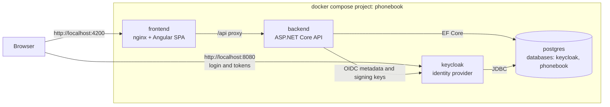

# Phone Book

Phone Book is a small full-stack application for storing phone numbers with role-based visibility. Users sign in through an identity provider, add phone numbers and view the ones they are allowed to see.

- Each entry is either **Personal** (visible only to its owner) or **Shared** (visible to every signed-in user).
- Entries are append-only. There is no way to edit or delete an entry anywhere: not in the UI, not in the API and not in the persistence layer.
- The owner of an entry is always taken from the `sub` claim of the validated access token, never from the request.

**Stack:** ASP.NET Core 10, Entity Framework Core, PostgreSQL 18, Angular 22 with Angular Material 3, Keycloak 26.8 (OAuth 2.0 and OpenID Connect), nginx, Docker Compose.

## Architecture



| Service | Role |
|---|---|
| `frontend` | nginx serving the Angular single-page application and proxying `/api` to the backend |
| `backend` | ASP.NET Core API that validates Keycloak access tokens and stores phone numbers |
| `keycloak` | Identity provider with the pre-configured realm `phonebook` |
| `postgres` | One PostgreSQL server with two databases: `keycloak` and `phonebook` |

Only the frontend and Keycloak ports are published to the host. PostgreSQL and the backend are reachable only inside the Docker networks.

The backend is split into layers inside one project: `Domain`, `Application`, `Infrastructure` and `Controllers`. The full design is described in [docs/ARCHITECTURE.md](docs/ARCHITECTURE.md).

## Requirements

- Docker with Docker Compose v2 (Docker Desktop on Windows and macOS, Docker Engine with the Compose plugin on Linux).
- Free ports `4200` and `8080` on the host. Both can be changed, see [Configuration](#configuration).
- Internet access on the first start to pull the images.

Nothing else needs to be installed to run the application.

## Quick start

```bash
docker-compose up
```

This starts PostgreSQL, Keycloak, the backend and the frontend in dependency order. Each service waits until the previous one is healthy, so when `http://localhost:4200` responds, the whole stack is ready. The first start takes a few minutes because Keycloak imports its realm.

`docker compose up` works the same way.

When an application image is not present on the machine yet, Compose pulls the published image, and builds it from source only when the pull fails. An image that is already present is reused as it is: Compose neither pulls a newer version nor rebuilds it. After `git pull` or any change to the code, build from source explicitly:

```bash
docker-compose up --build
```

Stop the stack and keep the data:

```bash
docker compose down
```

Stop the stack and delete all data, including the Keycloak realm import:

```bash
docker compose down -v
```

## Service addresses

| URL | Description |
|---|---|
| http://localhost:4200 | Phone Book application |
| http://localhost:4200/api/openapi/v1.json | OpenAPI document of the API, served through the nginx proxy |
| http://localhost:8080 | Keycloak |
| http://localhost:8080/admin | Keycloak admin console |
| http://localhost:8080/realms/phonebook/.well-known/openid-configuration | OIDC discovery document of the realm |

## Test users

| Username | Password | Role |
|---|---|---|
| `alice` | `alice` | Application user |
| `bob` | `bob` | Application user |
| `admin` | `admin` | Keycloak administrator, admin console only |

Self-registration is disabled. These are demo credentials for local use only.

## Visibility check

This walkthrough shows that personal entries stay private and shared entries are visible to everyone.

1. Open http://localhost:4200. You are redirected to the Keycloak login page.
2. Sign in as `alice` / `alice`.
3. Add an entry with the contact name `Alice private`, the number `+420 601 234 567` and the visibility **Personal**.
4. Add another entry with the contact name `Alice shared`, the number `+420 602 345 678` and the visibility **Shared**.
5. Alice sees both entries. The filter above the table switches between All, Personal and Shared.
6. Click **Sign out**.
7. Sign in as `bob` / `bob`. Using a private browser window avoids a lingering Keycloak session.
8. Bob sees only `Alice shared`. The entry `Alice private` is not listed under any filter.
9. Add a Personal and a Shared entry as bob, then sign in as alice again: alice sees bob's shared entry but not bob's personal one.

The API behaves the same way. Requesting another user's personal entry by id returns `404 Not Found`, exactly as for an id that does not exist.

## Container images

The application images are published to the GitHub Container Registry and are public, so they can be pulled without signing in:

| Image | Pull reference | Link |
|---|---|---|
| Backend | `ghcr.io/denisshi/phonebook-backend` | https://github.com/users/DenisShi/packages/container/package/phonebook-backend |
| Frontend | `ghcr.io/denisshi/phonebook-frontend` | https://github.com/users/DenisShi/packages/container/package/phonebook-frontend |

Both images are built for `linux/amd64` and `linux/arm64`, so they run natively on Intel, AMD and Apple Silicon machines.

Compose reads the namespace and the tag from environment variables:

```bash
PHONEBOOK_TAG=1.1.0 docker-compose up
```

To replace local `latest` images with the newest published ones, run `docker compose pull` before `docker compose up`.

PostgreSQL and Keycloak use the official images. Their configuration comes from files in this repository (`db/init` and `keycloak/realm`).

## Continuous integration and publishing

`.github/workflows/ci.yml` runs on every push and pull request with three jobs:

| Job | What it does |
|---|---|
| `backend` | Unit and integration tests, the latter with Testcontainers |
| `frontend` | Lint, unit tests and production build |
| `e2e` | Starts the stack with `docker compose up --build -d`, waits until every service is healthy, runs Playwright and stops the stack with `docker compose down -v`. On failure the Playwright report and the compose logs are uploaded as artifacts |

`.github/workflows/publish.yml` runs when a tag `vX.Y.Z` is pushed or when it is started manually. It first calls the CI workflow and builds the images only if all three jobs pass. The images are tagged with the semantic version (`X.Y.Z`, `X.Y` and `X`) and `latest` and pushed to `ghcr.io` with the built-in `GITHUB_TOKEN`, so no repository secrets are needed.

## Configuration

Every setting has a default, so no `.env` file is needed. Override a variable in the shell or in a `.env` file next to `docker-compose.yml`.

| Variable | Default | Purpose |
|---|---|---|
| `APP_PORT` | `4200` | Host port of the frontend |
| `KEYCLOAK_PORT` | `8080` | Host port of Keycloak and the public Keycloak URL |
| `IMAGE_NAMESPACE` | `ghcr.io/denisshi` | Registry and namespace of the application images |
| `PHONEBOOK_TAG` | `latest` | Tag of the application images |
| `POSTGRES_PASSWORD` | `postgres` | PostgreSQL superuser password |
| `KEYCLOAK_DB_PASSWORD` | `keycloak` | Password of the Keycloak database role |
| `APP_DB_PASSWORD` | `phonebook` | Password of the application database role |
| `KEYCLOAK_ADMIN_USER` | `admin` | Keycloak administrator name |
| `KEYCLOAK_ADMIN_PASSWORD` | `admin` | Keycloak administrator password |

Keycloak imports the realm only once. After changing `APP_PORT`, run `docker compose down -v` once so the redirect URIs are imported again.

## Local development without Docker for the applications

PostgreSQL and Keycloak still run in Docker. The backend and the frontend run on the host.

Requirements: .NET SDK 10 (see `backend/global.json`) and Node.js 24 with npm.

1. Start PostgreSQL and Keycloak. The dev overlay publishes PostgreSQL on `127.0.0.1:5432`:

   ```bash
   docker compose -f docker-compose.yml -f docker-compose.dev.yml up -d postgres keycloak
   ```

2. Run the backend on `http://localhost:5080`. The Development settings point it at `localhost:5432` and `localhost:8080`, and pending migrations are applied at startup:

   ```bash
   dotnet run --project backend/src/PhoneBook.Api
   ```

3. Run the frontend dev server on `http://localhost:4200`. It proxies `/api` to `http://localhost:5080`:

   ```bash
   cd frontend
   npm ci
   npm start
   ```

Stop `npm start` and the host backend before switching back to the full Docker stack. A dev server left running on port 4200 hides the Docker frontend.

## Running the tests

| Level | Command | Needs |
|---|---|---|
| Backend unit | `cd backend && dotnet test --project tests/PhoneBook.Api.UnitTests` | .NET SDK |
| Backend integration | `cd backend && dotnet test --project tests/PhoneBook.Api.IntegrationTests` | .NET SDK and a running Docker engine (Testcontainers starts PostgreSQL) |
| Frontend unit and lint | `cd frontend && npm ci && npm run lint && npm run test:ci` | Node.js |
| End-to-end | see below | The full stack running in Docker |

End-to-end tests drive a real browser through the real Keycloak login. Start the stack first, then run Playwright:

```bash
docker compose up -d --build --wait
cd e2e
npm ci
npx playwright install --with-deps chromium
npm test
```

The target address defaults to `http://localhost:4200` and can be changed with `E2E_BASE_URL`. `npm run report` opens the HTML report.

The validation rules for contact names and numbers live in `contracts/phone-number-validation-cases.json`. Both the backend and the frontend unit tests read this file, so the two sides cannot drift apart.

## API

All endpoints under `/api` require a bearer access token issued by the Keycloak realm `phonebook` for the audience `phonebook-api`. The OpenAPI 3.1 document is available at `/api/openapi/v1.json`.

| Method | Path | Description | Success | Errors |
|---|---|---|---|---|
| `GET` | `/api/phone-numbers?scope=all\|personal\|shared` | List the entries visible to the caller, newest first. `scope` defaults to `all` | `200` | `400`, `401` |
| `GET` | `/api/phone-numbers/{id}` | Get one entry. Missing entries and other users' personal entries both return `404` | `200` | `401`, `404` |
| `POST` | `/api/phone-numbers` | Create an entry owned by the caller | `201` with a `Location` header | `400`, `401`, `415` |
| `GET` | `/health/live`, `/health/ready`, `/health` | Liveness and readiness probes, anonymous, not proxied by nginx | `200` | `503` |

`PUT`, `PATCH` and `DELETE` do not exist on these routes and return `405 Method Not Allowed`.

Create request:

```json
{
  "contactName": "Alice Anderson",
  "number": "+420 601 234 567",
  "visibility": "PERSONAL"
}
```

Response:

```json
{
  "id": "0199a1b2-c3d4-7e5f-8a9b-0c1d2e3f4a5b",
  "contactName": "Alice Anderson",
  "number": "+420601234567",
  "visibility": "PERSONAL",
  "ownerUsername": "alice",
  "isOwnedByCurrentUser": true,
  "createdAt": "2026-10-02T12:34:56.789Z"
}
```

Validation rules:

- `contactName` is required and is trimmed. The trimmed value must be 1 to 100 characters.
- `number` is required and must be in international format: a leading `+` and the country calling code, for example `+420 601 234 567`. Spaces, `-`, `.`, `(` and `)` are allowed. The number must be valid for its country (known country code, correct length, assigned range), which is checked with libphonenumber on both the backend and the frontend. It is stored in E.164 form, for example `+420601234567`.
- `visibility` is required and must be `PERSONAL` or `SHARED`.

Errors are returned as `application/problem+json` (RFC 9457). Validation errors list the failing fields by their JSON names under `errors`. Owner fields in a request body are ignored.

## Key design decisions

### Issuer and hostname

The browser reaches Keycloak at `http://localhost:8080`, so every token carries the issuer `http://localhost:8080/realms/phonebook`. Inside Docker, the backend can reach Keycloak only at `http://keycloak:8080`. Keycloak would normally derive its issuer from the request URL, and the backend would reject the tokens.

The setup that solves this:

- Keycloak runs with `KC_HOSTNAME=http://localhost:8080`, which fixes the issuer, and `KC_HOSTNAME_BACKCHANNEL_DYNAMIC=true`, which lets the backchannel endpoints follow the request host.
- The backend downloads the OIDC metadata from the internal address `http://keycloak:8080` and validates tokens against the explicit external issuer `http://localhost:8080/realms/phonebook`. It checks the signature (`RS256` only), lifetime, issuer and audience locally, without calling Keycloak for each request.
- `KEYCLOAK_PORT` drives all three public URLs, so they cannot disagree.

### Runtime configuration of the frontend

The frontend image contains nothing specific to an environment. At startup the browser loads `/config.json`, which nginx generates from the environment variables `KEYCLOAK_URL`, `KEYCLOAK_REALM` and `KEYCLOAK_CLIENT_ID`. The same image therefore works with any Keycloak address without a rebuild. If the configuration is invalid, the page shows a plain error instead of starting the application.

### nginx proxy

nginx serves the SPA and proxies `/api` to the backend on the same origin, so the browser never makes a cross-origin API call and the backend needs no CORS configuration. The upstream is resolved at request time, so nginx starts even when the backend is down. Static assets with hashed names are cached for a year, while `index.html` and `config.json` are never cached.

### Migrations at startup

The backend applies EF Core migrations before it starts listening. A bounded retry loop covers a database that is still starting, and the readiness endpoint `/health/ready` succeeds only after the schema is current. Docker Compose restarts the backend if the database stays unreachable. Compose also orders the services with health checks, so the retry loop is only a safety net.

### Append-only data

There are no update or delete endpoints and no such controls in the UI. As a last line of defense, the database context throws if anything tries to modify or remove a stored entry.

## Known limitations

- **Keycloak runs in dev mode** (`start-dev`). This is intended for a local demo. A production deployment needs an optimized Keycloak build, a real hostname and secrets from a secret store.
- **Traffic uses plain HTTP** on `localhost`. There is no TLS. Keycloak allows HTTP only for local and private addresses, and the backend skips the HTTPS requirement for metadata only in the Compose and Development configurations.
- **Demo credentials** are committed as defaults for the users and the databases.
- **The hostname is `localhost`.** Only the ports are configurable.
- **No pagination or search.** The list returns every visible entry.
- **No brute-force protection or rate limiting** in the demo setup.
- **The Content Security Policy is minimal** (`frame-ancestors 'self'`).
- **The application database role owns its database** and runs the migrations.
- **Realm changes need a reset.** Keycloak imports the realm file once, so run `docker compose down -v` to apply changes to it.

The full list with production directions is in [docs/ARCHITECTURE.md](docs/ARCHITECTURE.md#14-out-of-scope-and-known-limitations).

## Repository layout

| Path | Contents |
|---|---|
| `backend/` | ASP.NET Core API, unit and integration tests, Dockerfile |
| `frontend/` | Angular application, nginx configuration, Dockerfile |
| `keycloak/realm/` | Keycloak realm imported at startup |
| `db/init/` | PostgreSQL initialization script that creates both databases |
| `contracts/` | Test fixtures shared by backend and frontend tests |
| `e2e/` | Playwright end-to-end tests |
| `docs/` | Architecture documentation |
| `docker-compose.yml` | The full stack |
| `docker-compose.dev.yml` | Overlay that publishes PostgreSQL and the backend for local development |
