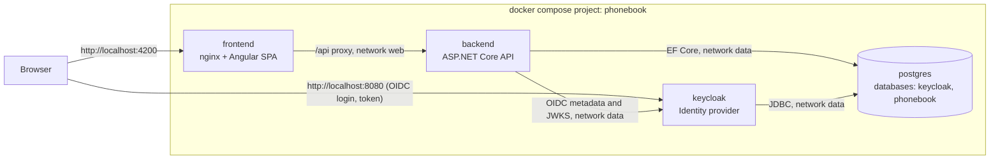
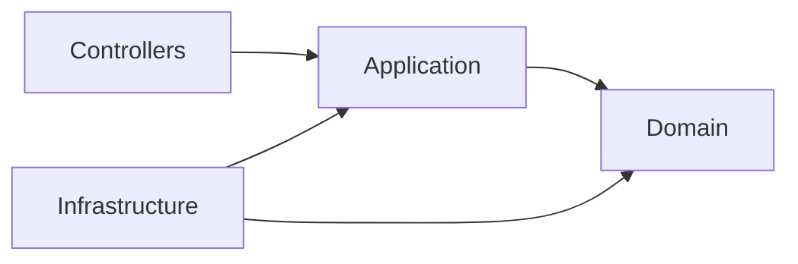
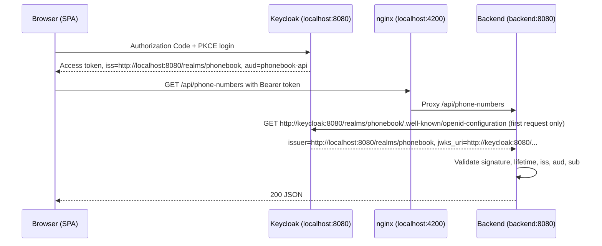

# Phone Book Architecture

This document records the architectural decisions for Phone Book. Every implementation step follows it. If an implementation has to deviate, update this document in the same change.

## Contents

- [Overview](#overview)
- [Versions](#versions)
- [1. Repository structure](#1-repository-structure)
- [2. Docker Compose topology](#2-docker-compose-topology)
- [3. Keycloak](#3-keycloak)
- [4. Issuer and hostname](#4-issuer-and-hostname)
- [5. Frontend delivery, runtime configuration and OIDC](#5-frontend-delivery-runtime-configuration-and-oidc)
- [6. Database schema and validation](#6-database-schema-and-validation)
- [7. Visibility model](#7-visibility-model)
- [8. API contract](#8-api-contract)
- [9. Migrations and database readiness](#9-migrations-and-database-readiness)
- [10. Container images and tags](#10-container-images-and-tags)
- [11. Testing strategy](#11-testing-strategy)
- [12. Conventions and best practices](#12-conventions-and-best-practices)
- [13. Local development](#13-local-development)
- [14. Out of scope and known limitations](#14-out-of-scope-and-known-limitations)

## Overview

Phone Book is a full-stack application for storing phone numbers. A signed-in user sees the list of phone numbers they are allowed to see. Entries can only be added and viewed; they can never be edited or deleted. When creating an entry, the user chooses its visibility:

- `PERSONAL`: visible only to the user who created it.
- `SHARED`: visible to every signed-in user.



### Invariants

The following rules cannot be broken. Any change that touches them requires an update to this document first.

1. There are no update or delete operations anywhere: not in the API, not in the UI, and not in the persistence layer.
2. The owner of an entry is always the `sub` claim of the validated access token. It is never taken from the request body, query or headers.
3. A `PERSONAL` entry is returned only to its owner. A `SHARED` entry is returned to every authenticated user.
4. `docker-compose up` in a clean clone starts the whole system without any manual preparation.
5. Everything in the repository is in English: UI, code, documentation, configuration and commit messages. Source and configuration files contain no comments of any kind.

## Versions

These versions were verified against the registries on 2026-10-02. Pin exact versions. Upgrade them deliberately, never implicitly.

| Component | Version | Image or package |
|---|---|---|
| .NET SDK | 10.0.401 | `mcr.microsoft.com/dotnet/sdk:10.0.401-alpine3.24`, `global.json` |
| ASP.NET Core runtime | 10.0.12 | `mcr.microsoft.com/dotnet/aspnet:10.0.12-alpine3.24` |
| EF Core, JwtBearer, OpenApi, Mvc.Testing | 10.0.12 | NuGet `Microsoft.*` |
| Npgsql EF Core provider | 10.0.3 | `Npgsql.EntityFrameworkCore.PostgreSQL` |
| Naming conventions | 10.0.1 | `EFCore.NamingConventions` |
| Testcontainers | 4.15.0 | `Testcontainers.PostgreSql` |
| xUnit | 4.0.1 | `xunit.v3`, which runs on Microsoft.Testing.Platform |
| Angular, Angular CLI, Angular Material | 22.2.x | npm `@angular/*` |
| TypeScript | 6.0.x | Angular 22 requires `>=6.0 <6.1`; TypeScript 7 is not supported |
| Vitest | within the `@angular/build` peer range | npm `vitest`, `jsdom` |
| keycloak-angular | 22.0.0 | npm |
| keycloak-js | 26.2.x | npm |
| Node.js | 24.21.0 LTS | `node:24.21.0-alpine3.24` |
| nginx (stable branch, unprivileged) | 1.30.5 | `nginxinc/nginx-unprivileged:1.30.5-alpine3.24` |
| Keycloak | 26.8.0 | `quay.io/keycloak/keycloak:26.8.0` |
| PostgreSQL | 18.6 | `postgres:18.6-alpine3.24` |
| Playwright | 1.63.0 | npm `@playwright/test` |

Keycloak 26.8 lists PostgreSQL 18 as a tested database.

## 1. Repository structure

```text
.
├── .github/
│   └── workflows/
│       └── publish.yml
├── backend/
│   ├── PhoneBook.slnx
│   ├── global.json
│   ├── nuget.config
│   ├── Directory.Build.props
│   ├── Directory.Packages.props
│   ├── .config/dotnet-tools.json
│   ├── .editorconfig
│   ├── Dockerfile
│   ├── .dockerignore
│   ├── src/
│   │   └── PhoneBook.Api/
│   │       ├── Program.cs
│   │       ├── appsettings.json
│   │       ├── appsettings.Development.json
│   │       ├── Domain/
│   │       ├── Application/
│   │       ├── Infrastructure/
│   │       │   ├── Auth/
│   │       │   └── Persistence/
│   │       │       └── Migrations/
│   │       └── Controllers/
│   └── tests/
│       ├── PhoneBook.Api.UnitTests/
│       └── PhoneBook.Api.IntegrationTests/
├── frontend/
│   ├── angular.json
│   ├── package.json
│   ├── proxy.conf.json
│   ├── Dockerfile
│   ├── .dockerignore
│   ├── nginx/
│   │   ├── default.conf.template
│   │   └── security-headers.conf
│   ├── public/
│   │   ├── config.json
│   │   └── silent-check-sso.html
│   └── src/
│       ├── main.ts
│       └── app/
│           ├── core/
│           │   ├── auth/
│           │   ├── config/
│           │   └── layout/
│           └── features/
│               └── phone-numbers/
│                   ├── data-access/
│                   ├── pages/
│                   ├── ui/
│                   └── validation/
├── keycloak/
│   └── realm/
│       └── phonebook-realm.json
├── db/
│   └── init/
│       └── 01-create-databases.sh
├── contracts/
│   └── phone-number-validation-cases.json
├── e2e/
│   ├── package.json
│   ├── playwright.config.ts
│   ├── setup/
│   ├── pages/
│   ├── support/
│   └── tests/
├── docs/
│   └── ARCHITECTURE.md
├── docker-compose.yml
├── docker-compose.dev.yml
├── README.md
├── .editorconfig
├── .gitattributes
└── .gitignore
```

| Path | Purpose |
|---|---|
| `backend/` | .NET 10 solution: one deployable API project and two test projects |
| `frontend/` | Angular 22 workspace, nginx template and frontend Dockerfile |
| `keycloak/realm/` | Realm file imported by Keycloak at startup |
| `db/init/` | PostgreSQL first-start script that creates the two databases and their roles |
| `contracts/` | Cross-stack test fixtures; the validation cases are consumed by both backend and frontend unit tests, which keeps both sides' validation identical |
| `e2e/` | Playwright end-to-end suite with its own `package.json` |
| `docs/` | Architecture documentation |
| `.github/workflows/` | Test pipeline and image publishing |

### Backend layering

`PhoneBook.Api` is the only deployable backend project. Folders inside it act as layers, and dependencies point in one direction only:



| Layer | Contents | Must not reference |
|---|---|---|
| `Domain` | `PhoneNumber` entity with a `Create` factory, `Visibility` enum, `PhoneNumberFormat` (normalization and validation rules), `VisibilityRules` (query predicates `VisibleTo`, `PersonalOf` and `SharedWithEveryone`) | Application, Infrastructure, ASP.NET Core, EF Core |
| `Application` | `PhoneNumberService`, request and response DTOs, `PhoneNumberScope` with its parser, `PhoneNumberQueries.VisibleIn` (applies the base predicate and then narrows it by scope), projections, the abstractions `ICurrentUser` and `IPhoneBookDbContext` | Infrastructure, ASP.NET Core (`HttpContext`, MVC types) |
| `Infrastructure/Persistence` | `AppDbContext` implementing `IPhoneBookDbContext`, entity configuration, migrations, startup migrator, `DatabaseOptions` | Controllers |
| `Infrastructure/Auth` | JwtBearer setup (`AddKeycloakAuthentication`, `ConfigureJwtBearerOptions`), `KeycloakOptions`, `CurrentUser` built on the claims principal | Controllers |
| `Controllers` | `PhoneNumbersController`, which is thin and delegates to Application | Infrastructure, EF Core |
| `Program.cs` | Composition root that calls one `Add...` extension method per layer | none |

Application uses EF Core LINQ through `IPhoneBookDbContext`, which exposes `DbSet<PhoneNumber>` and `SaveChangesAsync`. A repository layer on top of EF Core is deliberately not introduced.

### Frontend layout

- `core/config` loads and validates the runtime configuration.
- `core/auth` contains the Keycloak providers, the auth guard, the bearer-token URL condition, the interceptor that turns an API 401 into a new login, and `AuthSession`, which exposes the signed-in state, the username and sign-out.
- `core/layout` contains the header with the user name and the sign-out button.
- `features/phone-numbers/data-access` contains the API client, the DTO types and a signals-based store.
- `features/phone-numbers/ui` contains presentational components: the list, the form and the scope filter.
- `features/phone-numbers/pages` contains the routed page that composes those components.
- `features/phone-numbers/validation` contains the phone number and contact name validators.
- `src/testing` contains test-only helpers, such as the fake Keycloak. It is excluded from the application build and included only in the spec build.

File names follow the Angular 20+ style guide as generated by the pinned CLI, for example `phone-number-list.ts` without a `.component` suffix.

## 2. Docker Compose topology

The project name is set with the top-level key `name: phonebook`. This keeps container and volume names stable regardless of the clone folder name. There is no top-level `version` key. The file targets Docker Compose v2; both `docker compose` and the `docker-compose` alias work.

### Services

| Service | Image | Networks | Host port | Depends on (condition) | Health check |
|---|---|---|---|---|---|
| `postgres` | `postgres:18.6-alpine3.24` | `data` | none | none | `pg_isready` over TCP |
| `keycloak` | `quay.io/keycloak/keycloak:26.8.0` | `data` | `${KEYCLOAK_PORT:-8080}:8080` | postgres (`service_healthy`) | HTTP probe on management port 9000 |
| `backend` | `${IMAGE_NAMESPACE:-ghcr.io/denisshi}/phonebook-backend:${PHONEBOOK_TAG:-latest}` plus `build: ./backend` | `data`, `web` | none | postgres, keycloak (`service_healthy`) | Compose probe of `/health` (overrides the image `HEALTHCHECK`) |
| `frontend` | `${IMAGE_NAMESPACE:-ghcr.io/denisshi}/phonebook-frontend:${PHONEBOOK_TAG:-latest}` plus `build: ./frontend` | `web` | `${APP_PORT:-4200}:8080` | backend (`service_healthy`) | image `HEALTHCHECK` on `/healthz` |

Startup order: postgres, then keycloak, then backend, then frontend. Each service waits until the previous one reports healthy. When the frontend is reachable, everything behind it is ready.

The backend receives all of its configuration through environment variables:

| Variable | Compose value |
|---|---|
| `ConnectionStrings__PhoneBook` | `Host=postgres;Port=5432;Database=phonebook;Username=phonebook;Password=${APP_DB_PASSWORD:-phonebook};GSS Encryption Mode=Disable` |
| `Keycloak__MetadataAddress`, `Keycloak__ValidIssuer`, `Keycloak__Audience`, `Keycloak__RequireHttpsMetadata` | See [Issuer and hostname](#4-issuer-and-hostname) |

`GSS Encryption Mode=Disable` stops Npgsql from attempting GSSAPI encryption, which it prefers by default. The PostgreSQL container offers no Kerberos, and the Alpine runtime image has no `libgssapi_krb5`, so the attempt would only print a library loading error on every new connection.

The backend has `restart: on-failure`. If the database is unreachable for longer than the migration timeout, the process exits with a non-zero code and Docker restarts it. The other services use the default restart policy, so the stack never auto-starts on a reviewer's machine after a reboot.

### Networks

| Network | Members | Reason |
|---|---|---|
| `data` | postgres, keycloak, backend | Database and identity provider traffic |
| `web` | backend, frontend | nginx proxies `/api` to the backend; the frontend cannot reach the database |

### Published ports

Only the two browser-facing ports are published. PostgreSQL and the backend are not published, so a reviewer's local PostgreSQL or another service on port 5432 cannot break `docker-compose up`. For local development, the overlay file `docker-compose.dev.yml` publishes `127.0.0.1:5432` for postgres and `127.0.0.1:5080` for the backend (see [Local development](#13-local-development)).

### Variables

Every variable has an inline default (`${VAR:-default}`), so a clean clone needs no `.env` file. The defaults are demo values for local use and are documented in the README.

| Variable | Default | Used by |
|---|---|---|
| `APP_PORT` | `4200` | frontend host port; Keycloak redirect URIs via `APP_PUBLIC_URL` |
| `KEYCLOAK_PORT` | `8080` | Keycloak host port and public URL; backend `ValidIssuer`; frontend `KEYCLOAK_URL` |
| `IMAGE_NAMESPACE` | `ghcr.io/denisshi` | backend and frontend image names |
| `PHONEBOOK_TAG` | `latest` | backend and frontend image tags |
| `POSTGRES_PASSWORD` | `postgres` | PostgreSQL superuser |
| `KEYCLOAK_DB_PASSWORD` | `keycloak` | role `keycloak` |
| `APP_DB_PASSWORD` | `phonebook` | role `phonebook` |
| `KEYCLOAK_ADMIN_USER` | `admin` | Keycloak bootstrap admin |
| `KEYCLOAK_ADMIN_PASSWORD` | `admin` | Keycloak bootstrap admin |

If port 4200 or 8080 is busy, change `APP_PORT` or `KEYCLOAK_PORT`. Every dependent URL is derived from these two variables. Keycloak imports the realm only once, so after changing `APP_PORT` run `docker compose down -v` once to re-import it with the new redirect URIs.

### Volumes

| Volume | Mount | Purpose |
|---|---|---|
| `postgres-data` | `/var/lib/postgresql` | Persistent data for both databases |
| bind `./db/init` | `/docker-entrypoint-initdb.d` (read-only) | First-start database script |
| bind `./keycloak/realm` | `/opt/keycloak/data/import` (read-only) | Realm import |

PostgreSQL 18 images store data in `/var/lib/postgresql/18/docker` and declare the volume at `/var/lib/postgresql`. Mount the named volume at `/var/lib/postgresql`, not at the pre-18 path `/var/lib/postgresql/data`.

Keycloak and the backend keep no local state, so stopping and starting the stack preserves all data. `docker compose down -v` deletes everything and triggers a fresh database initialization and realm import.

### Health checks

| Service | Check | Interval / timeout / retries / start period |
|---|---|---|
| postgres | `pg_isready -h 127.0.0.1 -p 5432 -U postgres -d postgres` | 5s / 5s / 20 / 10s |
| keycloak | `bash -c` probe of `http://127.0.0.1:9000/health/ready`; healthy only on HTTP 200 | 10s / 5s / 30 / 30s |
| backend | Compose: `wget --quiet --tries=1 --spider http://localhost:8080/health`. The image also declares a `HEALTHCHECK` on `/health/ready` (10s / 3s / 6 / 60s) that applies when the image runs without Compose | 10s / 5s / 30 / 15s |
| frontend | Dockerfile `HEALTHCHECK`: `wget -q -O /dev/null http://127.0.0.1:8080/healthz` | 10s / 3s / 3 / 5s |

Pitfalls these checks are designed around:

- **PostgreSQL init phase.** During first initialization, the image runs a temporary server that listens only on the Unix socket while the scripts in `/docker-entrypoint-initdb.d` run. A socket-based `pg_isready` would report healthy before the databases exist. The TCP check with `-h 127.0.0.1` passes only once the final server is up.
- **No HTTP client in the Keycloak image.** The Keycloak image has neither curl nor wget. The probe opens `/dev/tcp/127.0.0.1/9000` in bash, writes a `GET /health/ready` request, reads the status line and requires ` 200 `. Health endpoints run on management port 9000 because `KC_HEALTH_ENABLED=true`. Inside `docker-compose.yml`, every `$` in the probe must be written as `$$` to escape Compose interpolation.
- **Wget in the app images.** The backend (aspnet Alpine) and frontend (nginx Alpine) images include busybox `wget`.

### PostgreSQL initialization

`db/init/01-create-databases.sh` runs once, when the volume is empty:

1. It reads `KEYCLOAK_DB_NAME`, `KEYCLOAK_DB_USER`, `KEYCLOAK_DB_PASSWORD`, `APP_DB_NAME`, `APP_DB_USER` and `APP_DB_PASSWORD` from the environment. Compose sets them to `keycloak`, `keycloak`, `${KEYCLOAK_DB_PASSWORD:-keycloak}`, `phonebook`, `phonebook` and `${APP_DB_PASSWORD:-phonebook}`.
2. It runs `psql -v ON_ERROR_STOP=1` with these values passed as psql variables. Inside the SQL, identifiers are quoted as `:"name"` and literals as `:'value'`, so no value is ever spliced into SQL text unquoted.
3. It creates two login roles and two databases, each owned by its role: `keycloak` and `phonebook`.
4. It runs `REVOKE CONNECT ON DATABASE ... FROM PUBLIC` on both databases, so each role can connect only to its own database.

The script uses `#!/usr/bin/env bash` and `set -euo pipefail`. It must have LF line endings, which `.gitattributes` enforces; a CRLF script fails inside the Linux container. It does not need the executable bit: the entrypoint sources non-executable `.sh` files.

## 3. Keycloak

### Server

| Setting | Value |
|---|---|
| Image | `quay.io/keycloak/keycloak:26.8.0` |
| Command | `start-dev --import-realm` |
| `KC_DB` | `postgres` |
| `KC_DB_URL` | `jdbc:postgresql://postgres:5432/keycloak` |
| `KC_DB_USERNAME` / `KC_DB_PASSWORD` | `keycloak` / `${KEYCLOAK_DB_PASSWORD:-keycloak}` |
| `KC_HOSTNAME` | `http://localhost:${KEYCLOAK_PORT:-8080}` |
| `KC_HOSTNAME_BACKCHANNEL_DYNAMIC` | `true` |
| `KC_HTTP_ENABLED` | `true` |
| `KC_HEALTH_ENABLED` | `true` |
| `KC_BOOTSTRAP_ADMIN_USERNAME` / `KC_BOOTSTRAP_ADMIN_PASSWORD` | `${KEYCLOAK_ADMIN_USER:-admin}` / `${KEYCLOAK_ADMIN_PASSWORD:-admin}` |
| `APP_PUBLIC_URL` | `http://localhost:${APP_PORT:-4200}`, consumed by the realm file placeholders |

`start-dev` is a deliberate choice for a local, HTTP-only demo. It uses a local cache, needs no build step and has relaxed defaults for localhost. A production deployment would use a prebuilt image with `start --optimized`, TLS, a real hostname and secrets from a secret store. This is listed in [known limitations](#14-out-of-scope-and-known-limitations).

### Realm `phonebook`

The realm file is `keycloak/realm/phonebook-realm.json`. Keep it minimal and declare only what differs from Keycloak defaults. This way Keycloak creates its built-in client scopes, roles and flows itself during the import.

| Realm setting | Value | Reason |
|---|---|---|
| `realm` / `displayName` | `phonebook` / `Phone Book` | |
| `enabled` | `true` | |
| `sslRequired` | `external` | HTTP is allowed from localhost and private addresses only |
| `registrationAllowed` | `false` | Only the predefined users exist |
| `resetPasswordAllowed` | `false` | No mail server |
| `editUsernameAllowed` | `false` | `owner_username` is a snapshot of the username |
| `loginWithEmailAllowed` | `true` | |
| `bruteForceProtected` | `false` | Avoids lockouts during negative e2e tests on a demo realm |
| `accessTokenLifespan` | `300` | Five minutes; the SPA refreshes tokens automatically |

### Client `phonebook-spa`

| Setting | Value |
|---|---|
| `clientId` / `name` | `phonebook-spa` / `Phone Book SPA` |
| `publicClient` | `true` (no secret, suitable for a browser) |
| `standardFlowEnabled` | `true` (Authorization Code) |
| `implicitFlowEnabled` | `false` |
| `directAccessGrantsEnabled` | `false` (no password grant) |
| `serviceAccountsEnabled` | `false` |
| `attributes."pkce.code.challenge.method"` | `S256` (the server rejects authorization requests without PKCE) |
| `rootUrl` | `${APP_PUBLIC_URL}` |
| `redirectUris` | `["${APP_PUBLIC_URL}/*"]` |
| `webOrigins` | `["+"]` (CORS origins follow the redirect URIs) |
| `attributes."post.logout.redirect.uris"` | `+` (same as the redirect URIs) |
| `frontchannelLogout` | `true` |

Keycloak resolves `${APP_PUBLIC_URL}` from the environment at import time. Compose sets it from `APP_PORT`. The default resolves to `http://localhost:4200`, which matches both the Docker frontend and `ng serve`.

### API audience

The API accepts only access tokens issued for it. A protocol mapper on `phonebook-spa` adds the audience:

| Mapper setting | Value |
|---|---|
| `name` | `phonebook-api-audience` |
| `protocolMapper` | `oidc-audience-mapper` |
| `config."included.custom.audience"` | `phonebook-api` |
| `config."access.token.claim"` | `true` |
| `config."id.token.claim"` | `false` |
| `config."introspection.token.claim"` | `true` |

The API never obtains tokens itself and has no roles, so it does not need its own Keycloak client. ID tokens have `aud: phonebook-spa`, so the backend's audience check also rejects an ID token sent by mistake.

### Test users

| Username | Password | First name | Last name | Email |
|---|---|---|---|---|
| `alice` | `alice` | Alice | Anderson | `alice@example.com` |
| `bob` | `bob` | Bob | Brown | `bob@example.com` |

Both users have `enabled: true`, `emailVerified: true`, a non-temporary password credential and empty `requiredActions`. Two users are enough to demonstrate that alice's personal entries are hidden from bob while shared entries are visible to both. These credentials are demo values for local use and are listed in the README.

### Import behaviour

`--import-realm` imports every file in `/opt/keycloak/data/import` on startup and skips realms that already exist. Editing the realm file has no effect until the database is reset with `docker compose down -v`.

### Pitfalls

- **Missing profile fields.** Since Keycloak 24, the declarative user profile requires `email`, `firstName` and `lastName`. If they are missing, the first login shows an "Update account information" page, which breaks the one-step login and the e2e suite.
- **The `sub` claim comes from the `basic` scope.** Since Keycloak 25, `sub` is emitted by the `basic` client scope. Do not set `defaultClientScopes` on the client, and do not define realm-level `clientScopes` in the realm file. If you do, `basic` can be lost and access tokens will have no `sub`.
- **No admin role in the app.** Keycloak administrators get no special access in the application.

## 4. Issuer and hostname

### Problem

The browser talks to Keycloak at `http://localhost:8080`, so the `iss` claim of every token the SPA obtains is `http://localhost:8080/realms/phonebook`. Inside the Docker network, `localhost` in the backend container is the backend itself; the backend can reach Keycloak only at `http://keycloak:8080`. By default, Keycloak derives the issuer from the request URL. The backend would then see the issuer `http://keycloak:8080/realms/phonebook` in the discovery document, compare it with the `iss` claim in browser-obtained tokens, and reject every request with a 401 (issuer validation failure).

### Decision

| Component | Setting | Value |
|---|---|---|
| Keycloak | `KC_HOSTNAME` | `http://localhost:${KEYCLOAK_PORT:-8080}` |
| Keycloak | `KC_HOSTNAME_BACKCHANNEL_DYNAMIC` | `true` |
| Backend | `Keycloak__MetadataAddress` | `http://keycloak:8080/realms/phonebook/.well-known/openid-configuration` |
| Backend | `Keycloak__ValidIssuer` | `http://localhost:${KEYCLOAK_PORT:-8080}/realms/phonebook` |
| Backend | `Keycloak__Audience` | `phonebook-api` |
| Backend | `Keycloak__RequireHttpsMetadata` | `false` (compose and Development only; the `appsettings.json` default is `true`) |
| Frontend | `KEYCLOAK_URL` in runtime config | `http://localhost:${KEYCLOAK_PORT:-8080}` |

How it works:

1. `KC_HOSTNAME` fixes Keycloak's frontend URL. The issuer and all browser-facing endpoints, such as the authorization endpoint and the login pages, are always `http://localhost:8080/...`, regardless of how Keycloak was reached.
2. With `KC_HOSTNAME_BACKCHANNEL_DYNAMIC=true`, backchannel endpoints in the discovery document (`token_endpoint`, `jwks_uri`, `userinfo_endpoint`, `introspection_endpoint`) are derived from the incoming request. When the backend fetches discovery from `http://keycloak:8080`, the document contains `issuer = http://localhost:8080/realms/phonebook` and `jwks_uri = http://keycloak:8080/realms/phonebook/protocol/openid-connect/certs`. The backend can download the signing keys, and the issuer matches the tokens.
3. The backend sets `MetadataAddress`, not `Authority`, to the internal URL, and sets `ValidIssuer` explicitly to the external issuer. Making the expected issuer explicit configuration catches drift immediately instead of trusting whatever discovery returns.
4. Only `RS256` signatures are accepted (`ValidAlgorithms`), which is the Keycloak realm default. Unsigned and HMAC-signed tokens are rejected even if their claims are correct.
5. JwtBearer downloads the discovery document and JWKS once, caches them, and validates each token locally: signature, lifetime, issuer and audience. Keycloak is not called on each request.



A single variable, `KEYCLOAK_PORT`, drives the public Keycloak URL used by Keycloak itself, the backend and the frontend, so the three can never disagree.

### Rejected alternatives

| Alternative | Why it was rejected |
|---|---|
| Reach Keycloak from the backend through `host.docker.internal` or `extra_hosts` | Platform-specific (needs `host-gateway` on Linux) and routes internal traffic through the host |
| Disable issuer validation, or accept any issuer | Weakens token validation for convenience |
| Leave the hostname dynamic and list both issuers in `ValidIssuers` | The issuer then depends on the request `Host` header, so tokens from different entry points carry different issuers; production mode does not allow it |
| Expose Keycloak to the browser through the nginx proxy | Mixes the SPA and identity-provider origins and complicates cookie paths and admin console access |

### Verification

- From the host: `http://localhost:8080/realms/phonebook/.well-known/openid-configuration` must report `issuer` `http://localhost:8080/realms/phonebook`.
- From inside the backend container: `docker compose exec backend wget -qO- http://keycloak:8080/realms/phonebook/.well-known/openid-configuration` must report the same `issuer`, with `jwks_uri` on `http://keycloak:8080`.

## 5. Frontend delivery, runtime configuration and OIDC

### Image and nginx

The frontend image has two stages:

1. **Build stage.** `FROM --platform=$BUILDPLATFORM node:24.21.0-alpine3.24`. It runs `npm ci` and `npm run build`. The JavaScript output does not depend on the CPU architecture, so it is built once on the native platform.
2. **Runtime stage.** `nginxinc/nginx-unprivileged:1.30.5-alpine3.24`. nginx runs as uid 101 and listens on port 8080. The stage copies the browser build output into `/usr/share/nginx/html`, `nginx/default.conf.template` into `/etc/nginx/templates/` and `nginx/security-headers.conf` into `/etc/nginx/snippets/`.

At container start, the stock nginx entrypoint runs `envsubst` on `/etc/nginx/templates/*.template` and writes the results into `/etc/nginx/conf.d/`. It substitutes only variables that are defined in the environment, so nginx runtime variables such as `$uri` stay untouched. The Dockerfile declares defaults for every template variable, so the image also runs on its own:

| Variable | Dockerfile default | Compose value |
|---|---|---|
| `KEYCLOAK_URL` | `http://localhost:8080` | `http://localhost:${KEYCLOAK_PORT:-8080}` |
| `KEYCLOAK_REALM` | `phonebook` | `phonebook` |
| `KEYCLOAK_CLIENT_ID` | `phonebook-spa` | `phonebook-spa` |
| `API_UPSTREAM` | `http://backend:8080` | `http://backend:8080` |
| `NGINX_RESOLVER` | `127.0.0.11` | default |

The nginx server block contains:

| Location | Behaviour |
|---|---|
| `/` | `try_files $uri $uri/ /index.html` for SPA deep links; `index.html` is served with `Cache-Control: no-cache` |
| hashed static assets (`.js`, `.css`, fonts, images) | `Cache-Control: public, max-age=31536000, immutable` |
| `/api/` | Proxied to `${API_UPSTREAM}` with `X-Forwarded-For`, `X-Forwarded-Proto` and `X-Forwarded-Host`. The upstream is held in a variable and resolved via `resolver ${NGINX_RESOLVER} valid=10s`, so nginx starts even when the backend is down and picks up a recreated backend container without a restart. With a variable `proxy_pass` and no URI part, the original request URI `/api/...` is passed through unchanged. |
| `= /config.json` | `return 200` with a JSON body built from `KEYCLOAK_URL`, `KEYCLOAK_REALM` and `KEYCLOAK_CLIENT_ID`; `default_type application/json`; `Cache-Control: no-store` |
| `= /healthz` | `return 200`, `access_log off` |

Server-wide settings are `server_tokens off`, gzip for text types, and the headers `X-Content-Type-Options: nosniff`, `Referrer-Policy: strict-origin-when-cross-origin` and `Content-Security-Policy: frame-ancestors 'self'`. The frame policy allows the SPA to frame its own `silent-check-sso.html`, which a blanket `X-Frame-Options: DENY` would block. nginx does not inherit `add_header` into a location that declares its own `add_header`, so the security headers live in one snippet, `nginx/security-headers.conf`, that every such location includes. A full script and style CSP is a production hardening item, see [known limitations](#14-out-of-scope-and-known-limitations).

Because nginx serves the SPA and proxies `/api` on the same origin, the browser never makes a cross-origin API call. The backend needs no CORS configuration. The only cross-origin calls go from the SPA to Keycloak, and Keycloak allows them through `webOrigins: ["+"]`.

### Runtime configuration

The published image must work with any Keycloak URL, realm or client without a rebuild. Nothing environment-specific is compiled into the bundle.

1. `main.ts` fetches `/config.json` with `cache: 'no-store'` before `bootstrapApplication`.
2. The response is validated: `keycloak.url`, `keycloak.realm` and `keycloak.clientId` must be non-empty strings, and the URL must be absolute. If validation fails, the page shows a plain error message instead of bootstrapping.
3. The validated object is passed into the application config factory, which calls `provideKeycloak` with it.

The configuration has this shape:

```json
{
  "keycloak": {
    "url": "http://localhost:8080",
    "realm": "phonebook",
    "clientId": "phonebook-spa"
  }
}
```

`frontend/public/config.json` contains these localhost defaults for `ng serve`. In the container, nginx's exact-match `location = /config.json` takes precedence over the static file. The API base path is always the same-origin relative path `/api` and is not configurable.

### OIDC library: keycloak-angular

The frontend uses **keycloak-angular 22** with **keycloak-js 26.2.x**.

| Criterion | keycloak-angular + keycloak-js | angular-oauth2-oidc |
|---|---|---|
| Maintainer | keycloak-js is maintained by the Keycloak project; keycloak-angular tracks Angular majors (22 for Angular 22) | Community, provider-agnostic; supports Angular 22 |
| Angular API | Standalone-first: `provideKeycloak`, `createAuthGuard`, `includeBearerTokenInterceptor` with URL conditions, `withAutoRefreshToken`, Keycloak events as a signal | Service-centric `OAuthService`, more manual wiring (discovery loading, refresh setup, resource server URLs) |
| Token storage | In memory in keycloak-js | `sessionStorage` by default, which is readable by any injected script |
| Fit for this project | Keycloak is a fixed requirement, so vendor coupling costs nothing | Provider independence is not needed |

The trade-off is that switching to a different identity provider would mean replacing the auth providers. Everything else, including API calls, the store and the components, does not depend on the library.

### Authentication flow in the SPA

| Concern | Decision |
|---|---|
| Init options | `onLoad: 'check-sso'`, `silentCheckSsoRedirectUri: <origin>/silent-check-sso.html`, `pkceMethod: 'S256'`, `checkLoginIframe: false` |
| Silent SSO page | `public/silent-check-sso.html` posts `location.href` to the parent window. Keycloak at `localhost:8080` and the SPA at `localhost:4200` are same-site, so the hidden iframe receives the Keycloak session cookie without third-party cookie restrictions |
| Routes | `''` redirects to `phone-numbers`; `phone-numbers` lazy-loads the page component and is protected by the auth guard; `**` redirects to `phone-numbers` |
| Guard | Built with `createAuthGuard`. An unauthenticated user is sent to `keycloak.login({ redirectUri })` with the requested URL, so an anonymous visitor always ends up on the Keycloak login page |
| Bearer token | `includeBearerTokenInterceptor` with a single condition, URL pattern `^/api(/\|$)`. The token is never attached to `config.json`, static assets or Keycloak requests. The interceptor refreshes a token that is about to expire before attaching it |
| Refresh | `withAutoRefreshToken` with `onInactivityTimeout: 'logout'` and a session timeout aligned with the Keycloak SSO idle timeout |
| Logout | `keycloak.logout({ redirectUri: window.location.origin })`, which is allowed by `post.logout.redirect.uris: +` |
| 401 from the API | Treated as an expired session: the SPA starts a login with the current URL as the redirect |
| Server validation errors | `400` responses with `application/problem+json` are mapped onto the matching form controls through the `errors` keys (`contactName`, `number`, `visibility`) |

### UI

- Angular Material 22 with a Material 3 theme.
- The list page shows a table with the columns Name, Number, Visibility (a "Personal" or "Shared" chip), Owner (the username, marked "You" for the current user) and Created. Above the table, a button-toggle filter offers All, Personal and Shared. The page also has loading, empty and error states.
- The add form uses reactive form fields for the contact name and the number, and a radio group for visibility with **Personal** preselected, so the least-exposed option is the default. Errors are shown through `mat-error`. After a successful save, the list reloads.
- There are no edit or delete controls anywhere.
- Every input has a visible label, which keeps the UI accessible and lets Playwright use `getByLabel`. A `data-testid` is added only where no role or label identifies an element.

## 6. Database schema and validation

### Databases and roles

| Database | Owner role | Used by |
|---|---|---|
| `keycloak` | `keycloak` | Keycloak (schema managed by Keycloak) |
| `phonebook` | `phonebook` | Backend (schema managed by EF Core migrations) |

Each role can connect only to its own database. The application role owns its database because it applies migrations; separate migration and runtime roles are a production refinement.

### Table `phone_numbers`

EF Core migrations generate this schema. The SQL below is the reference that the migration must produce. Names use snake_case through `EFCore.NamingConventions`.

```sql
CREATE TABLE phone_numbers (
    id              uuid         NOT NULL,
    contact_name    varchar(100) NOT NULL,
    number          varchar(16)  NOT NULL,
    visibility      varchar(16)  NOT NULL,
    owner_id        varchar(255) NOT NULL,
    owner_username  varchar(255) NOT NULL,
    created_at      timestamptz  NOT NULL,
    CONSTRAINT pk_phone_numbers PRIMARY KEY (id),
    CONSTRAINT ck_phone_numbers_visibility CHECK (visibility IN ('PERSONAL', 'SHARED')),
    CONSTRAINT ck_phone_numbers_number_format CHECK (number ~ '^\+?[0-9]{3,15}$')
);

CREATE INDEX ix_phone_numbers_owner_id_created_at
    ON phone_numbers (owner_id, created_at DESC);

CREATE INDEX ix_phone_numbers_shared_created_at
    ON phone_numbers (created_at DESC)
    WHERE visibility = 'SHARED';
```

| Column | Source | Notes |
|---|---|---|
| `id` | Application, `Guid.CreateVersion7(timeProvider.GetUtcNow())` | Time-ordered UUIDv7 keeps index inserts sequential |
| `contact_name` | Request, trimmed | 1 to 100 characters |
| `number` | Request, normalized | Stored in canonical form, for example `+420601234567` |
| `visibility` | Request | Stored as the enum's wire value |
| `owner_id` | Access token `sub` | Kept as an opaque string, not `uuid`: `sub` is defined by OIDC as a string, and Keycloak's UUID format is an implementation detail |
| `owner_username` | Access token `preferred_username`, or `sub` when absent | A snapshot taken at creation time, so the list needs no user lookup; Keycloak usernames are not editable in this realm |
| `created_at` | Injected `TimeProvider` (UTC) | Set by the application, not by a database default, so tests are deterministic |

### Indexes

The list query is `visibility = 'SHARED' OR owner_id = @sub`, sorted by `created_at DESC, id DESC`. PostgreSQL can satisfy each side of the `OR` from its own index and combine them with a BitmapOr:

- `ix_phone_numbers_owner_id_created_at` serves the owner side and the `personal` scope.
- The partial index `ix_phone_numbers_shared_created_at` serves the shared side and the `shared` scope, and contains only shared rows.

There is no unique constraint. Two users may store the same number, and one user may store the same number twice under different names.

### Validation rules

Backend and frontend apply identical rules. The backend enforces them authoritatively with DataAnnotations on the request DTO, plus custom attributes that call `PhoneNumberFormat`. The database CHECK constraints are the last line of defense.

| Field | Rule |
|---|---|
| `contactName` | Required. Leading and trailing whitespace is trimmed. The trimmed value must be 1 to 100 characters. Whitespace-only input is invalid. |
| `number` | Required. Leading and trailing whitespace is trimmed, and the trimmed input must be at most 32 characters. Normalization removes spaces, `-`, `.`, `(` and `)`. The result must be in international format: a leading `+`, then digits only. The number is parsed with libphonenumber (`libphonenumber-csharp` on the backend, `libphonenumber-js` with full metadata on the frontend) and must be a valid number for its country: known country calling code, a length allowed by that country and a range that is assigned. The E.164 form of the parsed number is what gets stored and returned. |
| `visibility` | Required, with no server-side default. Must be `PERSONAL` or `SHARED`; the JSON enum converter matches the name case-insensitively, ignores surrounding spaces and responses always use the upper-case form. |

Examples: `+420 601 234 567` is stored as `+420601234567`. `+49 (30) 1234-5678` is stored as `+493012345678`. `+44 (0) 20 7946 0958` is stored as `+442079460958`, because the trunk prefix `0` is not part of the international number. These inputs are invalid: `601 234 567` and `(02) 1234-5678` (no country calling code), `00420601234567` (the `00` prefix instead of `+`), `112` (a short code, not a subscriber number), `+420 123` and `+420 601 234 5678` (wrong length for the Czech Republic), `+420 101 234 567` (an unassigned range), `+999 123 456 789` (unknown country calling code) and `+420 601 234 567 ext 2` (letters).

The database CHECK constraint `ck_phone_numbers_number_format` checks only the shape of the stored value. Numbering plans change over time, so validity for a country is checked when an entry is created and is not enforced again by the database.

`contracts/phone-number-validation-cases.json` is the single source of test vectors. Both the xUnit and the Vitest suites read it, so a rule change that touches only one side fails a test. Its shape is:

```json
{
  "contactName": {
    "valid": [{ "input": "  Alice Anderson ", "normalized": "Alice Anderson" }],
    "invalid": ["", "   "]
  },
  "number": {
    "valid": [{ "input": "+420 601 234 567", "normalized": "+420601234567" }],
    "invalid": ["601 234 567", "+420 123", "+999 123 456 789"]
  }
}
```

Length-boundary cases, such as 100 and 101 characters or 32 and 33 characters, are generated inside the tests rather than stored as long literals.

## 7. Visibility model

### Identity

- The current user is the authenticated principal produced by JwtBearer from a validated access token.
- `MapInboundClaims = false` keeps the original claim names: `sub` stays `sub`.
- The JwtBearer `OnTokenValidated` event fails authentication when `sub` is missing or empty, so such a request gets **401**.
- `ICurrentUser` exposes `Subject`, taken from `sub`, and `Username`, taken from `preferred_username` with a fallback to `sub`. It is the only way the Application layer learns who the caller is.
- The request DTO has no owner fields. System.Text.Json ignores unknown members, so a client that sends `ownerId` or `ownerUsername` changes nothing. An integration test proves this.

### Query predicate

Every read goes through one base predicate, defined once in `Domain/VisibilityRules` as an expression that EF Core translates to SQL:

```text
entry.Visibility == SHARED  OR  entry.OwnerId == currentUser.Subject
```

The `scope` filter only narrows this predicate. It is combined with AND, so it can never widen visibility:

| `scope` | Effective filter | Meaning |
|---|---|---|
| `all` (default) | `Visibility == SHARED OR OwnerId == sub` | Everything the caller may see |
| `personal` | `OwnerId == sub AND Visibility == PERSONAL` | The caller's personal list |
| `shared` | `Visibility == SHARED` | The shared list, including the caller's own shared entries |

### Other users' personal entries

- They never appear in any list.
- `GET /api/phone-numbers/{id}` for another user's personal entry returns **404 Not Found**, exactly the same response as for an id that does not exist. The response gives no hint whether the record exists.
- The API returns no `ownerId` values, only `ownerUsername` and the boolean `isOwnedByCurrentUser`.

### Append-only enforcement

1. **API.** No PUT, PATCH or DELETE endpoints exist.
2. **UI.** No edit or delete controls exist.
3. **Persistence.** `AppDbContext` overrides `SaveChanges` and `SaveChangesAsync` and throws `InvalidOperationException` when the change tracker contains a `PhoneNumber` entry in the `Modified` or `Deleted` state. This keeps a future code path from mutating entries by accident.

## 8. API contract

Base path: `/api`. Every endpoint except health and OpenAPI requires a valid bearer token. The authorization fallback policy requires an authenticated user, so a new endpoint is protected by default.

### Endpoints

| Method | Path | Success | Errors |
|---|---|---|---|
| `GET` | `/api/phone-numbers?scope={all,personal,shared}` | `200` with `PhoneNumberResponse[]` | `400` unknown scope, `401` |
| `GET` | `/api/phone-numbers/{id:guid}` | `200` with `PhoneNumberResponse` | `401`, `404` not found or not visible |
| `POST` | `/api/phone-numbers` | `201` with `Location: /api/phone-numbers/{id}` and `PhoneNumberResponse` | `400` validation, `401`, `415` content type other than `application/json` |
| `GET` | `/api/openapi/v1.json` | `200` OpenAPI 3.1 document | none (anonymous) |
| `GET` | `/health/live`, `/health/ready`, `/health` | `200` (`503` when not ready; `/health` runs every check, like `/health/ready`) | none (anonymous; not proxied by nginx) |

There is **no PUT, PATCH or DELETE**. Endpoint routing answers these methods on `/api/phone-numbers` and `/api/phone-numbers/{id}` with **405 Method Not Allowed** and an `Allow` header. An anonymous caller gets 401 before that, because authorization runs first.

The `scope` query parameter accepts `all`, `personal` and `shared`, case-insensitively, and defaults to `all`. Any other value, including numeric strings, returns 400. An empty `scope=` is bound as absent and means `all`.

The list is ordered by `createdAt` descending, then by `id` descending. It returns all entries visible under the scope; see [known limitations](#14-out-of-scope-and-known-limitations) about pagination.

### DTOs

`CreatePhoneNumberRequest`:

```json
{
  "contactName": "Alice Anderson",
  "number": "+420 601 234 567",
  "visibility": "PERSONAL"
}
```

`PhoneNumberResponse`:

```json
{
  "id": "0199a1b2-c3d4-7e5f-8a9b-0c1d2e3f4a5b",
  "contactName": "Alice Anderson",
  "number": "+420601234567",
  "visibility": "PERSONAL",
  "ownerUsername": "alice",
  "isOwnedByCurrentUser": true,
  "createdAt": "2026-10-02T12:34:56.789Z"
}
```

Serialization rules:

- Property names are camelCase.
- `visibility` is a string enum with the values `PERSONAL` and `SHARED`. The converter is `JsonStringEnumConverter(JsonNamingPolicy.SnakeCaseUpper, allowIntegerValues: false)`, so numeric enum values are rejected.
- `createdAt` is an ISO 8601 UTC timestamp.
- Unknown request properties are ignored.

### Errors

Every error response has the content type `application/problem+json` and follows RFC 9457. Responses that would otherwise have an empty body, such as 401, 404 and 405, also get a ProblemDetails body. This is wired with `AddProblemDetails`, `UseExceptionHandler` and `UseStatusCodePages`.

Validation errors use `ValidationProblemDetails`. Their `errors` keys are the JSON property names, which is wired by registering `SystemTextJsonValidationMetadataProvider`:

```json
{
  "type": "https://tools.ietf.org/html/rfc9110#section-15.5.1",
  "title": "One or more validation errors occurred.",
  "status": 400,
  "errors": {
    "number": ["Enter a valid phone number in international format, for example +420 601 234 567."],
    "visibility": ["The visibility field is required."]
  },
  "traceId": "00-4bf92f3577b34da6a3ce929d0e0e4736-00f067aa0ba902b7-01"
}
```

| Status | When |
|---|---|
| 400 | Validation failure, malformed JSON, unknown `visibility` or `scope` value |
| 401 | Missing, malformed, expired or wrongly signed token; wrong `iss` or `aud`; missing `sub` |
| 404 | Entry not found or not visible to the caller |
| 405 | PUT, PATCH or DELETE on a phone number route |
| 415 | `POST` with a content type other than `application/json` |
| 500 | Unhandled error; generic ProblemDetails with no stack trace or exception details outside Development |

### OpenAPI

The built-in `Microsoft.AspNetCore.OpenApi` package (not Swashbuckle) generates OpenAPI 3.1 at `/api/openapi/v1.json`. Through nginx, it is reachable at `http://localhost:4200/api/openapi/v1.json`.

Descriptions come from attributes, never from XML comments: `[EndpointSummary]`, `[EndpointDescription]`, `[ProducesResponseType]` and `[Description]` on DTO properties. A document transformer declares the bearer security scheme.

## 9. Migrations and database readiness

1. Migrations live in `Infrastructure/Persistence/Migrations`. They are created with the local tool from `backend/.config/dotnet-tools.json` (`dotnet-ef` 10.0.12): `dotnet ef migrations add <Name> --project src/PhoneBook.Api --output-dir Infrastructure/Persistence/Migrations`.
2. `DatabaseMigrationHostedService` runs the migration in `StartAsync`. `WebApplicationBuilder` registers the web host service last, so every hosted service of the application completes before Kestrel starts listening, and `/health/ready` cannot succeed before the schema is current. Running the migration in `Program.cs` after `Build()` is avoided because `WebApplicationFactory` stops the entry point right after `Build()` and the integration tests would then skip the real migration path.
3. `DatabaseMigrator` runs `Database.MigrateAsync()` through a bounded retry loop that uses the injected `TimeProvider`:
   - It retries only on transient failures: `NpgsqlException` with `IsTransient`, `PostgresException` with SQL state `57P03` (server is starting up), `SocketException` and `TimeoutException`.
   - The delay grows from 1 second up to 10 seconds.
   - The total time is bounded by `Database:MigrationTimeout`, 90 seconds by default.
   - Every attempt is logged at Information level and the final failure at Critical level. After the final failure `StartAsync` throws, `Program.cs` returns exit code 1, and the Compose `restart: on-failure` policy tries again.
4. `Database:ApplyMigrationsOnStartup` defaults to `true`. Integration tests keep it on, so they exercise the real migration path against the Testcontainers database.
5. EF Core 9 and later take a database-wide migration lock in `MigrateAsync`, so several replicas starting at once do not apply the same migration twice.
6. Inside Compose, `depends_on: postgres: condition: service_healthy` already orders the startup. The retry loop covers environments without Compose ordering and short database restarts.

Generated migration files contain comments by default: `// <auto-generated />` and `/// <inheritdoc />`. Strip them, as required by the no-comments rule. `.editorconfig` marks `**/Migrations/*.cs` with `generated_code = true`, so analyzers keep treating these files as generated after the comment marker is gone.

The production alternative to migrating at startup is an EF migration bundle run as a one-shot job before the API starts. It is not used here because it would need an extra artifact per architecture and an extra Compose service.

## 10. Container images and tags

| Image | GitHub Container Registry package | Platforms |
|---|---|---|
| Backend | `ghcr.io/denisshi/phonebook-backend` | `linux/amd64`, `linux/arm64` |
| Frontend | `ghcr.io/denisshi/phonebook-frontend` | `linux/amd64`, `linux/arm64` |

The GitHub Container Registry was chosen over Docker Hub because the workflow authenticates with the built-in `GITHUB_TOKEN`: there are no long-lived registry credentials to create, store or rotate. A package published from a workflow with `GITHUB_TOKEN` is linked to the repository and inherits its visibility, so the images are public and can be pulled anonymously.

PostgreSQL and Keycloak use the official images. Their configuration comes from bind-mounted repository files (`db/init`, `keycloak/realm`), so no custom images are published for them.

### Compose: published images and source builds

Each application service declares both `image: ${IMAGE_NAMESPACE:-ghcr.io/denisshi}/phonebook-<name>:${PHONEBOOK_TAG:-latest}` and `build: ./<name>`. According to the Compose specification, when `pull_policy` is not set, the policy is `missing`: Compose pulls an image only when it is not present locally, and builds from source only when the pull fails. An image that is already present is reused without checking the registry. As a result:

- `docker-compose up` in a clean clone runs the published images.
- `docker-compose up --build` builds both images from source.
- `docker compose pull` refreshes a `latest` image that was pulled earlier.

If the image has not been published yet, the pull fails and Compose builds the image from source instead, tagging it with the same `image:` name. Later runs of `docker-compose up` reuse that local image, so after changing source code use `docker-compose up --build`.

`PHONEBOOK_TAG=1.1.0 docker-compose up` pins a specific release.

### Tag strategy

The tags are computed by `docker/metadata-action`:

| Trigger | Tags |
|---|---|
| Git tag `vX.Y.Z` | `X.Y.Z`, `X.Y`, `X`, `latest` |
| Manual `workflow_dispatch` on a branch | `latest` |

The images carry the standard OCI labels generated by `docker/metadata-action`.

### Publishing pipeline

- `ci.yml` runs on every branch push and pull request and can also be called as a reusable workflow (`workflow_call`). It has three jobs: `backend` (unit and integration tests), `frontend` (lint, unit tests, production build) and `e2e` (the full Compose stack plus Playwright).
- `publish.yml` runs on pushed tags `v*.*.*` and on `workflow_dispatch`. Its first job calls `ci.yml`; the `publish` job declares `needs: [ci]`, so images are published only when every test suite is green.
- The `publish` job is a matrix over `backend` and `frontend`. It runs `docker/setup-qemu-action`, `docker/setup-buildx-action`, `docker/login-action` against `ghcr.io` with `GITHUB_TOKEN`, `docker/metadata-action`, and `docker/build-push-action` with `platforms: linux/amd64,linux/arm64` and the GitHub Actions build cache.
- The image namespace is the lowercased repository owner, because registry names must be lowercase.
- Both Dockerfiles run their build stages with `FROM --platform=$BUILDPLATFORM`. The backend publishes with `dotnet publish -a $TARGETARCH`, and the Angular output does not depend on the architecture. Final stages only copy files, so compilation never runs under QEMU emulation.
- Workflow permissions default to `contents: read`. Only the `publish` job adds `packages: write`.

## 11. Testing strategy

Tests follow the testing pyramid: many fast unit tests, fewer integration tests with a real database, and a small set of end-to-end journeys through the real browser login.

| Level | Tooling | Runs against | Speed |
|---|---|---|---|
| Backend unit | xUnit v3 | In-memory objects | Seconds |
| Backend integration | xUnit v3, `WebApplicationFactory<Program>`, Testcontainers PostgreSQL | Real API pipeline and a real PostgreSQL 18 with real migrations | Tens of seconds |
| Frontend unit | Vitest through the official `@angular/build:unit-test` builder, jsdom environment (no Karma, no Jest) | Angular `TestBed` | Seconds |
| End-to-end | Playwright with TypeScript, folder `e2e/` | Full `docker compose` stack with a real Keycloak login | Minutes |

### Backend unit tests

Project: `backend/tests/PhoneBook.Api.UnitTests`. No Docker, no network, no database.

| Covered | How |
|---|---|
| Visibility predicate and scopes | `[Theory]` over owner (same or other user) × visibility (`PERSONAL`, `SHARED`) × scope (`all`, `personal`, `shared`). The expressions from `VisibilityRules` are compiled and applied to in-memory lists |
| Normalization and validation | `PhoneNumberFormat` and the contact name rule, driven by `contracts/phone-number-validation-cases.json` plus generated length boundaries |
| Request DTO validation | `Validator.TryValidateObject` for required fields, lengths and missing visibility |
| Entity creation | `PhoneNumber.Create` trims the name, normalizes the number, generates a UUIDv7 and takes `createdAt` from `FakeTimeProvider` |
| Mapping | The projection sets `isOwnedByCurrentUser` to true for the owner and false for anyone else; the response type has no owner id property |
| Current user | `CurrentUser` reads `sub` and `preferred_username`, falls back to `sub` for the username, and throws when `sub` is missing |
| Keycloak options and JwtBearer setup | `KeycloakOptions` rejects missing and relative URLs and defaults `RequireHttpsMetadata` to true; `ConfigureJwtBearerOptions` maps metadata address, issuer, audience and `RS256`, sets `MapInboundClaims = false`, and its `OnTokenValidated` handler fails tokens without `sub` |
| Scope parsing | Accepts `all`, `personal` and `shared` case-insensitively; rejects unknown and numeric values |

Deliberately not covered at this level: controllers and HTTP status codes, EF Core SQL translation, JwtBearer behavior. These belong to integration tests. Framework internals are not tested at all.

Naming: one test class per subject, `<Subject>Tests`. Methods are named `Method_Condition_ExpectedResult`, for example `IsVisibleTo_PersonalEntryOfAnotherUser_ReturnsFalse`.

### Backend integration tests

Project: `backend/tests/PhoneBook.Api.IntegrationTests`. Requires a running Docker engine.

- **Database.** `Testcontainers.PostgreSql` starts `postgres:18.6-alpine3.24`, the same tag as Compose, defined once as a constant. There is one container per test collection, shared through a collection fixture. Before each test, `TRUNCATE phone_numbers` resets the data, and tests inside a collection run sequentially, so assertions can expect exact results.
- **Migrations.** The factory points the connection string at the container. The real startup migration path creates the schema, so every test run also validates the migrations.
- **Test authentication scheme.** `ApiFactory` replaces JwtBearer with a header-driven `TestAuthHandler`. The headers `X-Test-Sub` and `X-Test-Username` define the caller. A request without them gets `AuthenticateResult.NoResult()`, which produces a 401.
- **Real token validation.** `JwtApiFactory` keeps the real JwtBearer configuration but replaces the OIDC configuration with an in-memory `OpenIdConnectConfiguration` holding a test RSA key, so no metadata is fetched. Tests sign tokens with `JsonWebTokenHandler`. This checks the actual issuer, audience, lifetime and `sub` rules without Keycloak.

| Covered | Expected |
|---|---|
| alice creates a personal and a shared entry; bob lists | bob sees only the shared entry, with `isOwnedByCurrentUser: false` |
| alice lists with each scope | `all`, `personal` and `shared` return the correct subsets in `createdAt desc, id desc` order |
| bob requests alice's personal entry by id | 404, the same as for a random id |
| Request without credentials | 401 with a ProblemDetails body |
| Authenticated PUT, PATCH and DELETE on the collection and item routes | 405 with an `Allow` header |
| Invalid bodies: empty or whitespace-only name, names of 100 and 101 characters, number length and digit-count boundaries, missing or unknown `visibility`, numeric, boolean, array and object `visibility`, wrong field types, malformed JSON | 400 `ValidationProblemDetails` with camelCase `errors` keys |
| Unknown `scope` | 400 |
| Non-JSON content type on POST | 415 |
| Body containing `ownerId` and `ownerUsername` of another user | Ignored; the stored owner is the authenticated caller |
| POST success | 201, a `Location` header that resolves through GET, and a normalized `number` |
| Append-only guard | Modifying or removing a tracked `PhoneNumber` through `AppDbContext` throws |
| `JwtApiFactory`: valid token / wrong `iss` / wrong `aud` / expired or not yet valid / missing or blank `sub` / ID token / foreign key, HMAC or unsigned / tampered payload or signature / not a JWT | 200 / 401 for every invalid case, with no entry stored |
| `JwtApiFactory`: alice and bob with real signed tokens | alice sees her personal and every shared entry; bob never sees alice's personal entry; the stored owner is `sub` and the username is `preferred_username`, falling back to `sub` |
| `JwtApiFactory`: PUT, PATCH and DELETE | 405 with a valid token, 401 without one |
| OpenAPI document | Anonymous 200; contains no PUT, PATCH or DELETE operations |
| Health endpoints | Anonymous 200 |

Deliberately not covered at this level: Keycloak itself, nginx and the UI. These belong to e2e tests.

Naming follows the unit test convention. Classes are grouped by feature, for example `PhoneNumbersVisibilityTests`, `PhoneNumbersValidationTests` and `AuthenticationTests`.

### Frontend unit tests

Tooling: Vitest through `@angular/build:unit-test` in the jsdom environment. Spec files sit next to their subjects as `*.spec.ts`. Tests use `TestBed`, `provideHttpClientTesting` with `HttpTestingController`, a fake `Keycloak` instance provided through DI, and Angular Material component harnesses from `@angular/cdk/testing` for component interaction.

| Subject | Covered |
|---|---|
| Runtime config loader | A valid config is accepted; missing or empty fields and a relative URL are rejected |
| `PhoneNumbersApi` | Correct URLs and `scope` parameter; the POST body contains only `contactName`, `number` and `visibility` |
| Bearer-token condition | The token is attached for `/api` and `/api/phone-numbers`, and not for `/config.json`, `/apiary` or the Keycloak URL |
| Auth guard | Authenticated users pass; unauthenticated users trigger `login` with the requested URL as the redirect, and the guard returns false |
| Validators | Phone number and contact name validators, driven by `contracts/phone-number-validation-cases.json` |
| Add form component | Personal is the default visibility; error messages appear; submit is blocked while the form is invalid; server ProblemDetails `errors` map onto the fields; the form resets after success |
| List component | Rendering of rows, chips and the "You" marker; loading, empty and error states; the filter emits the selected scope; no edit or delete controls |
| Store | A scope change reloads the list; a successful create reloads the list; errors surface as state |

Deliberately not covered: keycloak-js and Angular Material internals, real HTTP, styling, and full-application navigation. Navigation belongs to e2e tests.

Naming: `describe('<UnitName>')` with `it('<behavior in plain English>')`, for example `it('defaults visibility to PERSONAL')`.

### End-to-end tests

Folder: `e2e/` at the repository root. It has its own `package.json`, `playwright.config.ts` and `tsconfig.json`, and uses `@playwright/test` 1.63.0.

| Setting | Value |
|---|---|
| `baseURL` | `process.env.E2E_BASE_URL`, default `http://localhost:4200` |
| Credentials | `E2E_ALICE_USERNAME`, `E2E_ALICE_PASSWORD`, `E2E_BOB_USERNAME`, `E2E_BOB_PASSWORD`, defaults matching the realm users |
| Projects | `setup` (logs in through Keycloak), `chromium` (depends on `setup`; required); `firefox` is optional and enabled by setting `E2E_FIREFOX=1` |
| Authentication state | The setup project signs in alice and bob through the real Keycloak login form and saves `storageState` to `e2e/.auth/alice.json` and `e2e/.auth/bob.json` (git-ignored). The Keycloak session cookie in that state lets the SPA's silent check-sso restore the session |
| Retries | 1 on CI, 0 locally |
| Artifacts | `trace: 'retain-on-failure'`, `screenshot: 'only-on-failure'`, `video: 'retain-on-failure'`, HTML reporter |
| Waiting | Web-first assertions and auto-waiting locators only; no fixed sleeps |

- **Page Object Model.** `pages/keycloak-login.page.ts`, `pages/phone-numbers.page.ts` and `pages/add-phone-number.form.ts`. Locators use `getByRole`, `getByLabel` and, as a last resort, `getByTestId`. There are no CSS or XPath selectors tied to layout.
- **Test data.** Each run creates names with a unique suffix, for example `E2E Shared 1696247696123-ab12`. Tests then work regardless of order, leftovers from earlier runs and repeated execution. Assertions target these names instead of row counts.

| Scenario | Expected |
|---|---|
| Anonymous visit to `/` | Redirect to the Keycloak login page of realm `phonebook` |
| Sign in and sign out | The header shows the username; sign-out returns to the Keycloak login on the next visit |
| alice adds a personal and a shared entry | Both appear in alice's list with the correct chips |
| bob opens the list | bob sees alice's shared entry and does not see alice's personal entry |
| Filter All, Personal, Shared | Each filter shows the correct subset |
| Invalid form input | Field errors are shown and nothing is saved |
| Edit or delete affordances | No edit or delete buttons, links or menu items exist on the page |

Deliberately not covered: the full validation matrix and API status codes (unit and integration tests), visual regression and performance.

Naming: one spec file per journey (`auth.spec.ts`, `add-phone-number.spec.ts`, `visibility.spec.ts`, `filter.spec.ts`, `validation.spec.ts`, `read-only.spec.ts`). Test titles are plain sentences, for example `test('bob does not see alice personal number')`.

### Commands

| Level | Command |
|---|---|
| Backend unit | `dotnet test --project tests/PhoneBook.Api.UnitTests` in `backend/` |
| Backend integration (Docker running) | `dotnet test --project tests/PhoneBook.Api.IntegrationTests` in `backend/` |
| Backend, all | `dotnet test --solution PhoneBook.slnx` in `backend/` |
| Backend coverage (Docker running) | `dotnet tool restore` in `backend/`, then for each test project build it and run `dotnet coverlet <test dll> --target dotnet --targetargs "exec <test dll>" --include "[PhoneBook.Api]*" --exclude-by-file "**/Migrations/*.cs" -f json -f cobertura -o ../coverage/<name>`; pass `--merge-with ../coverage/<unit>.json` to the second run to get one combined report |
| Frontend unit, watch | `npm test` in `frontend/` (runs `ng test`) |
| Frontend unit, CI with coverage | `npm run test:ci` in `frontend/` (runs `ng test --watch=false --coverage`) |
| Frontend lint | `npm run lint` in `frontend/` |
| End-to-end | `docker compose up -d --build --wait`, then in `e2e/`: `npm ci`, `npx playwright install chromium`, `npm test` |
| End-to-end, headed / report | `npm run test:headed` / `npm run report` in `e2e/` |

### Continuous integration

The job `ci` in `.github/workflows/publish.yml` runs on pushes to `main`, on pull requests, on version tags and on manual runs.

| Step | Command |
|---|---|
| Backend unit tests | `dotnet test --project tests/PhoneBook.Api.UnitTests` in `backend/`, with the SDK selected by `global.json` |
| Backend integration tests | `dotnet test --project tests/PhoneBook.Api.IntegrationTests` in `backend/`; Testcontainers uses the runner's Docker engine |
| Frontend | `npm ci`, `npm run lint`, `npm run test:ci`, `npm run build` in `frontend/` |

The end-to-end suite and the English-only check are not part of the pipeline yet. Run the e2e suite locally against the Compose stack (see Commands above) before merging changes that touch the running stack. Adding an `e2e` job that starts the stack with `docker compose up -d --build --wait` and runs Playwright is the planned extension.

### Definition of Done

A step that adds or changes behavior is done only when:

1. The behavior is covered by tests at the levels defined above. Domain rules get unit tests, HTTP and persistence behavior gets integration tests, UI logic gets frontend unit tests, and user journeys get e2e tests.
2. Every suite is green locally: backend unit, backend integration, frontend unit and lint, and e2e when the step touches the running stack.
3. CI is green.

A failing or skipped test is never "done". Tests are fixed, not deleted or skipped, unless the behavior they cover was intentionally removed and this document says so.

## 12. Conventions and best practices

### Repository-wide

- **English only.** UI text, identifiers, documentation, configuration, log messages, Keycloak display names and commit messages are in English. Review enforces this; an automated check is not part of the pipeline yet.
- **No comments in source or configuration files.** That means no `//`, `/* */`, `///` XML documentation, `<!-- -->`, `#` comment lines in YAML, Dockerfile, nginx, shell, `.editorconfig` or `.gitignore`, and no TODO markers. A shebang line is not a comment. Code explains itself through names and structure. OpenAPI text comes from attributes.
- **Scaffold comments are removed.** Templates leave comments behind and must be cleaned: `dotnet new` (for example in `Program.cs`), `ng new` (`tsconfig.json`, `styles.scss`, `.editorconfig`, `.gitignore`) and EF Core migrations.
- **Commits.** Conventional Commits in English, for example `feat(api): add phone number creation endpoint`. Commits are small and the build is green at every commit.
- **`.gitattributes`.** `* text=auto eol=lf`. Shell scripts, JSON and YAML always use LF.
- **`.editorconfig`.** The root file sets UTF-8, LF, final newline, 4-space indentation for C#, and 2 spaces for TypeScript, HTML, SCSS, JSON and YAML. `backend/.editorconfig` holds the .NET analyzer settings: `generated_code = true` for `**/Migrations/*.cs`, the analyzer severities and the test-only relaxations. It lives inside the backend build context and the Dockerfile copies it, so the container build applies the same analyzer rules as a local build. Analyzer severities are tuned there, never with suppression comments.

### .NET

- `global.json` requires SDK `10.0.100` with `rollForward: latestFeature`, so the 10.0.401 image used in Docker and any locally installed 10.0.x SDK both satisfy it. It also sets `test.runner` to `Microsoft.Testing.Platform`, which `xunit.v3` and `dotnet test` on .NET 10 require. `nuget.config` clears machine-level sources and maps only nuget.org, which Central Package Management requires.
- `Directory.Build.props` applies `net10.0`, `Nullable` enabled, `ImplicitUsings` enabled, `TreatWarningsAsErrors`, `EnforceCodeStyleInBuild`, `AnalysisLevel` `latest` with `AnalysisMode` `Recommended`, and `GenerateDocumentationFile` `false`.
- Central Package Management (`Directory.Packages.props`) holds every package version in one place.
- Async all the way. Every I/O method is async and accepts a `CancellationToken`, which flows from the action parameter. There is no `.Result` or `.Wait()`.
- Dependency injection uses constructor injection and primary constructors. Each layer registers itself through one extension method: `AddApplication`, `AddPersistence`, `AddCurrentUser` (the Keycloak JwtBearer registration `AddKeycloakAuthentication` joins it in the Auth layer) and `AddApi`. `DbContext` is scoped. `TimeProvider.System` is registered as a singleton and replaced in tests.
- Configuration uses the options pattern: `KeycloakOptions` (section `Keycloak`) and `DatabaseOptions` (section `Database`) are bound with `ValidateDataAnnotations().ValidateOnStart()`, so a missing setting fails at startup. The connection string is `ConnectionStrings:PhoneBook`. In containers, every value comes from environment variables such as `Keycloak__ValidIssuer`.
- Controllers are `[ApiController]` classes with attribute routing. They contain no business logic, return `ActionResult<T>` and declare `[ProducesResponseType]` for every status code.
- EF Core: Fluent API configuration in `IEntityTypeConfiguration<T>` classes, `AsNoTracking()` and projection to DTOs for reads, snake_case names, explicit lengths and check constraints.
- Errors: exceptions are not used for control flow. A missing entry is returned as a null result and mapped to 404.
- Logging: `ILogger<T>` with message templates (structured logging). Tokens, passwords and full request bodies are never logged.
- Security: no secrets in images or `appsettings.json`. `RequireHttpsMetadata` is relaxed only in Compose and Development configuration.

### Angular

- Standalone components only, no NgModules. Zoneless change detection, as configured by the pinned CLI. `ChangeDetectionStrategy.OnPush` on every component.
- Signals for state: `signal`, `computed`, signal inputs and outputs (`input()`, `output()`). Dependencies come from `inject()`. Templates use the built-in control flow (`@if`, `@for` with `track`).
- Feature routes are lazy-loaded with `loadComponent`.
- Typed reactive forms (`NonNullableFormBuilder`).
- HTTP: `provideHttpClient(withFetch(), withInterceptors([...]))`.
- TypeScript strict mode: `strict`, `noImplicitOverride`, `noPropertyAccessFromIndexSignature`, `noImplicitReturns`, `noFallthroughCasesInSwitch`. Angular `strictTemplates`, `strictInjectionParameters` and `strictInputAccessModifiers`. No `any`; DTO types mirror the API contract.
- Linting and formatting: angular-eslint flat config plus Prettier. `npm run lint` must pass with zero warnings.
- Presentational components (`ui/`) receive data through inputs and emit events. Only pages and the store talk to services.

### Docker and Compose

- Multi-stage builds. Build stages run on `$BUILDPLATFORM`; final stages contain only runtime artifacts.
- Base images are pinned to exact versions, as listed in [Versions](#versions).
- Containers run as non-root users: the backend as `USER $APP_UID`, the built-in `app` user of the .NET images; the frontend as uid 101 from nginx-unprivileged. Both listen on port 8080.
- Layer caching: the backend copies `*.csproj`, `Directory.*.props`, `global.json`, `nuget.config` and `.editorconfig` and restores before copying sources; the frontend copies `package.json` and `package-lock.json` and runs `npm ci` before copying sources.
- Each build context has a `.dockerignore` excluding `bin`, `obj`, `node_modules`, `dist`, `.angular`, test results and IDE folders. Patterns for nested folders use `**/` (for example `**/bin/`), because a plain `bin/` matches only the context root and would let host build output into the image.
- `HEALTHCHECK` is defined in the application Dockerfiles; Compose defines health checks for the third-party images.
- No secrets in images or build arguments. All configuration is provided at runtime through environment variables.
- Compose: `depends_on` with `condition: service_healthy`, inline variable defaults, a named data volume and read-only bind mounts for configuration.

## 13. Local development

| Task | Command |
|---|---|
| Run the full stack from published images | `docker-compose up` |
| Run the full stack built from source | `docker-compose up --build` |
| Reset all data and re-import the realm | `docker compose down -v` |
| Start only PostgreSQL and Keycloak, with PostgreSQL published on `127.0.0.1:5432` | `docker compose -f docker-compose.yml -f docker-compose.dev.yml up -d postgres keycloak` |
| Run the backend on the host (`http://localhost:5080`) | `dotnet run --project backend/src/PhoneBook.Api` |
| Run the frontend dev server (`http://localhost:4200`; proxies `/api` to `http://localhost:5080` through `proxy.conf.json`) | `npm start` in `frontend/` |

`appsettings.Development.json` points the backend at `localhost:5432` and at Keycloak on `http://localhost:8080`, for both `MetadataAddress` and `ValidIssuer`, with `RequireHttpsMetadata` set to `false`. When the backend runs on the host, the discovery document is fetched from `localhost:8080` and backchannel URLs resolve to `localhost`, so no extra configuration is needed.

Stop `ng serve` and the host backend before switching to the full Docker stack. `ng serve` listens on `[::1]:4200` and the host backend on `localhost:5080`, while Docker publishes its ports on all addresses. Browsers try `::1` first for `localhost`, so a dev server left running silently shadows the Docker frontend on the same port. Alternatively, run the stack on another port, for example `APP_PORT=4300` after `docker compose down -v`.

| URL | Service |
|---|---|
| `http://localhost:4200` | Application |
| `http://localhost:8080/admin` | Keycloak admin console (`admin` / `admin`) |
| `http://localhost:4200/api/openapi/v1.json` | OpenAPI document |

## 14. Out of scope and known limitations

| Topic | Current state | Production direction |
|---|---|---|
| Transport security | HTTP on localhost only | TLS at a reverse proxy, HTTPS everywhere, `RequireHttpsMetadata = true` |
| Keycloak mode | `start-dev` | Prebuilt image with `start --optimized`, real hostname, clustered cache if replicated |
| Credentials | Demo users and passwords committed as Compose defaults | Secrets from a secret store; no default passwords |
| Hostname | `localhost` only; ports are configurable | A public hostname variable feeding the same three settings |
| Pagination and search | The list returns every visible entry | Keyset pagination on `(created_at, id)` and server-side search |
| Editing and deleting | Not possible by design | Not planned; entries are append-only by design |
| Brute-force protection | Disabled in the demo realm | Enabled with temporary lockout |
| Content Security Policy | Only `frame-ancestors 'self'` | Full CSP with hashes (Angular `autoCsp`), plus `connect-src` and `frame-src` for the Keycloak origin |
| Database roles | The application role owns its database and runs migrations | Separate migration and runtime roles; migrations as a pre-deployment job |
| Rate limiting | None | ASP.NET Core rate limiter on the API |
| Realm changes | Imported once; `docker compose down -v` re-imports | Managed through the admin API or a configuration-as-code tool |
| Image tag | Compose defaults to `latest` | Pin `PHONEBOOK_TAG` to a release |
